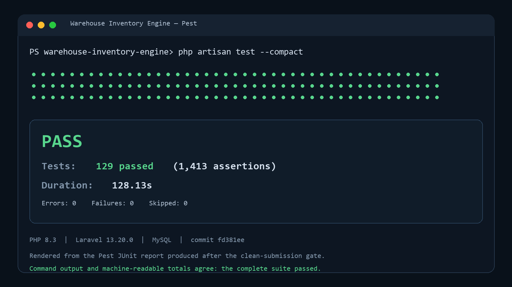

# Warehouse Inventory Reservation Engine

A Laravel 13 / MySQL implementation of the inventory core behind a multi-warehouse ERP. It prioritizes inventory correctness under concurrent reservations, retries, partial fulfillment, provider timeouts, and duplicate callbacks.

The application includes:

- Available, reserved, picked, packed, shipped, and delivered quantity tracking.
- Canonical inventory movements with transactionally maintained warehouse-balance projections.
- Partial reservations, release, expiration, FIFO backorder recovery, picking, packing, reversals, and partial shipments.
- Pessimistic locking, stable operation keys, request-hash conflict detection, and database uniqueness.
- A persistent mock shipping provider with deterministic or weighted outcomes.
- Signed HTTP callbacks, durable webhook receipts, retry state, duplicate protection, out-of-order handling, and status reconciliation.
- An authenticated server-rendered Bootstrap/jQuery operational UI, reports, dashboard, commands, jobs, scheduler recovery, and deterministic demo data.
- A small risk-based Pest suite running against MySQL.

## Requirements

- PHP 8.3 or later.
- Composer 2.
- MySQL 8.0 or later.
- Node.js 20.19 or later, or Node.js 22.12 or later, and npm.
- A database user allowed to create and modify the application and test databases.

## Clean Setup

Clone or download the submitted repository, open its root directory, and install PHP dependencies:

```bash
cd warehouse-inventory-engine
composer install
```

Create the environment file and application key:

```bash
cp .env.example .env
php artisan key:generate
```

On PowerShell, use `Copy-Item .env.example .env` instead of `cp`.

Create two MySQL databases:

```sql
CREATE DATABASE warehouse_inventory_engine
    CHARACTER SET utf8mb4 COLLATE utf8mb4_unicode_ci;
CREATE DATABASE warehouse_inventory_engine_testing
    CHARACTER SET utf8mb4 COLLATE utf8mb4_unicode_ci;
```

Set the matching MySQL credentials in `.env`. The Pest configuration changes only `DB_DATABASE` to `warehouse_inventory_engine_testing`, so the test database uses the same host, port, username, and password.

Configure the administrator and local provider runtime:

```dotenv
APP_NAME="Warehouse Inventory Engine"
APP_ENV=local
APP_URL=http://127.0.0.1:8000

DB_CONNECTION=mysql
DB_HOST=127.0.0.1
DB_PORT=3306
DB_DATABASE=warehouse_inventory_engine
DB_USERNAME=root
DB_PASSWORD=

QUEUE_CONNECTION=database
DB_QUEUE_RETRY_AFTER=90

ADMIN_NAME="Warehouse Administrator"
ADMIN_EMAIL=administrator@example.test
ADMIN_PASSWORD=choose-a-local-password

MOCK_PROVIDER_WEBHOOK_URL="${APP_URL}/webhooks/shipping-provider"
MOCK_PROVIDER_WEBHOOK_SECRET=replace-with-a-long-random-local-secret
```

Never commit real credentials or a production webhook secret.

Create the schema and reference data:

```bash
php artisan migrate --seed
```

The seeders create three reference products, two warehouses, zero-valued balances for each product/warehouse pair, and the configured administrator. They do not invent stock or movement history.

Install and build frontend assets:

```bash
npm install
npm run build
```

## Run the Application

For the complete local provider flow, use four terminals:

```bash
php artisan serve --host=127.0.0.1 --port=8000
php artisan queue:work --timeout=60 --tries=3
php artisan schedule:work
npm run dev
```

Open `http://127.0.0.1:8000` and sign in with `ADMIN_EMAIL` and `ADMIN_PASSWORD`.

Why these processes matter:

- Provider callbacks are real signed HTTP requests to `MOCK_PROVIDER_WEBHOOK_URL`.
- `QUEUE_CONNECTION=sync` is intentionally unsupported for this loopback callback flow.
- The worker timeout is 60 seconds; `DB_QUEUE_RETRY_AFTER` must remain greater than it so a timed-out job is not concurrently leased to another worker.
- The scheduler rediscovers interrupted shipment submission, reconciliation, mock callback, inbound webhook, backorder, and expiration work once per minute.

`composer run dev` is convenient for ordinary UI work, but it does not start the scheduler. Use the four-process setup for the reliability demonstration.

## Deterministic Demonstration

Build the agreed scenarios through the same application services used by the UI, commands, and jobs:

```bash
php artisan demo:inventory-scenarios
```

To remove only `DEMO-` / `demo:` records and rebuild them:

```bash
php artisan demo:inventory-scenarios --reset
```

Use `--force` only when an unattended local reset is intentional. Both demo commands reject non-local, non-testing environments.

Demonstrate two users competing for the final unit:

```bash
php artisan demo:concurrent-reservation
```

The scenario command prepares:

- A 10-unit request with 6 allocated and 4 outstanding.
- Provider acceptance followed by a simulated timed-out response.
- Permanent provider rejection.
- Duplicate-callback provider behavior.
- An out-of-order delivery receipt waiting for shipment confirmation.
- A shipment ready for manual confirmation.

The shipment screen exposes local-only controls for selecting the next provider outcome, sending confirmation or delivery now, deliberately sending delivery out of order, and replaying the original webhook.

Equivalent guarded commands are:

```bash
php artisan mock-provider:send-webhook <mock-provider-shipment-id> shipment.confirmed
php artisan mock-provider:send-webhook <mock-provider-shipment-id> delivery.confirmed
php artisan mock-provider:send-webhook <mock-provider-shipment-id> delivery.confirmed --out-of-order
php artisan mock-provider:replay-webhook <mock-provider-shipment-id>
```

## Recovery Commands

The scheduler invokes these bounded, overlap-protected commands:

```bash
php artisan shipments:process-pending --limit=50
php artisan provider-submissions:reconcile-unknown --limit=50
php artisan mock-provider:dispatch-pending --limit=50
php artisan provider-webhooks:process-pending --limit=50
php artisan inventory:allocate-backorders --batch=50
php artisan reservations:expire --batch=50
```

Application services and database constraints provide correctness. Job uniqueness and the scheduler reduce duplicate work and recover interrupted work; they are not the sole idempotency mechanism.

## Tests and Quality Checks

Create the testing database first, then run:

```bash
php artisan test --compact
```

Focused groups:

```bash
php artisan test --compact tests/Unit
php artisan test --compact tests/Feature/Smoke
php artisan test --compact tests/Feature/Critical
```

Formatting and frontend build:

```bash
vendor/bin/pint --format agent
npm run build
```

The highest-risk concurrency, duplicate job, callback, and opposite-transfer tests intentionally repeat three times in the full suite. See [Testing Evidence](docs/testing-evidence.md) for acceptance-scenario traceability.



## Core Business Decisions

- A balance row stores only warehouse stock: available, reserved, picked, and packed. Shipped stock is external and derived from confirmed packed-to-external movements.
- Reservation allocation is partial; requested, allocated, and outstanding quantities remain explicit.
- Confirmed reservations do not expire. Temporary reservations may expire only before physical fulfillment begins.
- Release changes only reserved stock. Packed or picked stock requires explicit compensating fulfillment actions.
- Transfers consume available stock only; reserved, picked, and packed quantities never move through the ordinary transfer operation.
- Shipment composition assigns packed quantity but does not deduct it.
- Provider acceptance is not shipment confirmation. Only a valid persisted `shipment.confirmed` webhook moves packed stock to shipped.
- A timeout means the provider outcome is unknown. Reconciliation reuses the stable provider request key and cannot bypass webhook processing.
- Exact callback duplicates reuse the provider/event identity and immutable raw body; a changed body under that identity is a conflict.
- The required human UI is one configured administrator using Blade forms. A general JSON API and broad RBAC are outside the challenge scope.

The complete decisions and observable examples are in the [Business Rules Handbook](docs/business-rules/README.md) and [Decision Register](docs/business-rules/decision-register.md).

## Security

- Operational routes require authentication and the configured administrator gate.
- Forms use Form Requests, authorization, validation, CSRF protection, and idempotency keys for business mutations.
- Provider callbacks use an HMAC-SHA256 signature, timestamp replay window, event identity checks, raw-body preservation, JSON structure validation, and rate limiting.
- Lifecycle quantities are not mass assignable and database checks protect categorical and quantity invariants.
- Mock-provider controls and demo setup are rejected outside local/testing environments.
- Logs and UI avoid displaying secrets or the raw signed callback body.

## Assumptions and Limitations

- One business administrator is sufficient for the challenge. User administration, multi-role permissions, and multi-tenancy are deferred.
- MySQL is required for the tested locking, check constraints, and query-plan behavior.
- The persistent mock provider is designed for deterministic local review, not as a reusable carrier product.
- The local callback URL must be reachable from the queue worker. HTTPS, secret rotation, provider IP controls, and a production carrier adapter would be deployment work.
- Database queue/cache are suitable for the demonstration. Higher throughput would move queue and distributed locks to Redis and partition or archive the append-only movement ledger.
- Catalog administration intentionally supports activation/deactivation rather than destructive deletion.
- No general JSON API is required; the provider webhook is the machine-to-machine boundary.
- Read-only ledger-to-projection reconciliation is documented as optional future work and is not implemented.
- Containerization, CI hosting, observability dashboards, metrics, and alerting are deployment improvements rather than challenge requirements.

## Documentation

- [Documentation index](docs/README.md)
- [Business rules](docs/business-rules/README.md)
- [Acceptance scenarios](docs/business-rules/acceptance-scenarios.md)
- [Selected ERD approach](docs/erd-approaches/02-pessimistic-locking.md)
- [System architecture](docs/ARCHITECTURE.md)
- [AI usage and engineering ownership](docs/AI_USAGE.md)
- [Video walkthrough and recording script](docs/VIDEO_WALKTHROUGH.md)
- [Testing evidence](docs/testing-evidence.md)
- [Local shipping runtime](docs/local-shipping-runtime.md)
- [Local administrator setup](docs/local-administrator.md)

The final video URL is pending owner recording and upload; it must replace the pending status in the walkthrough document before submission.
