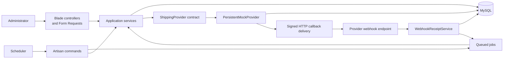
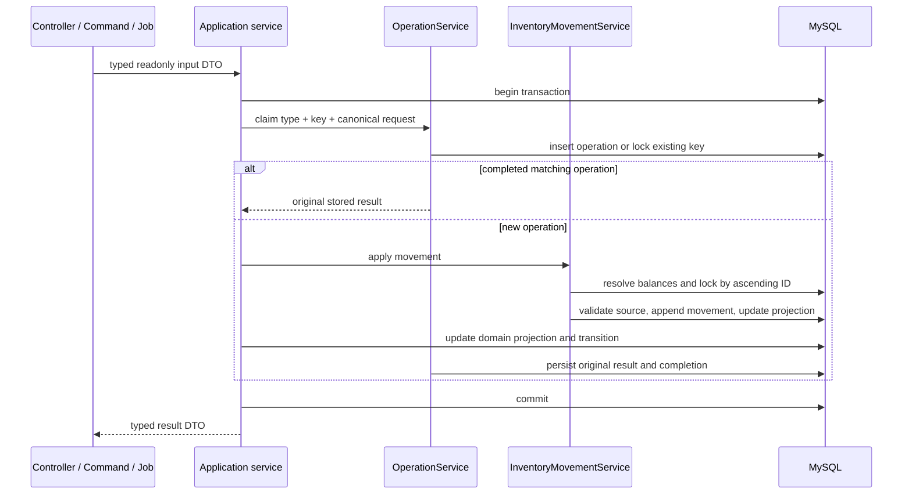
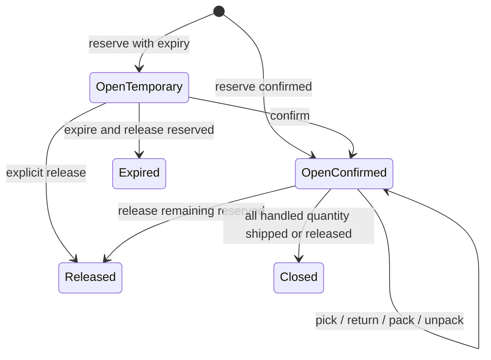
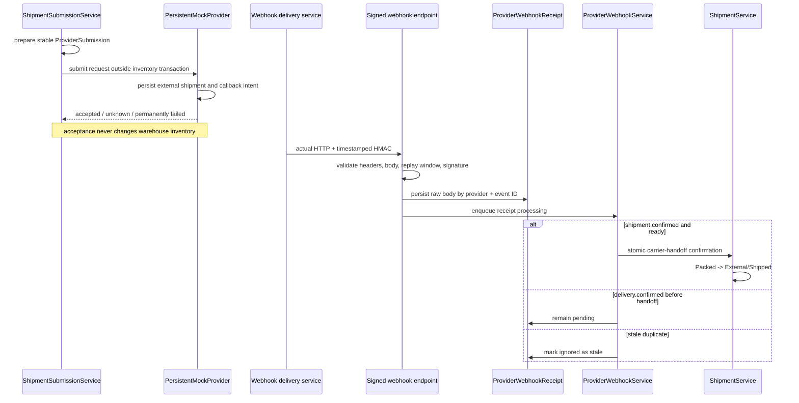

# System Architecture

## 1. Purpose and Boundaries

This application is a warehouse inventory reservation engine built for a job-interview challenge. Its design prioritizes explainable correctness under duplicate requests, concurrent allocation, transaction failure, provider timeouts, and duplicate or out-of-order callbacks.

The selected approach is a MySQL-backed movement ledger with synchronous balance projections and pessimistic row locking. It is deliberately not event sourced and does not introduce repositories, a message bus, or distributed coordination that the challenge does not need.

The application exposes:

- An authenticated, server-rendered Bootstrap/Blade operational UI.
- Artisan commands and queued jobs for background and recovery work.
- One HMAC-authenticated shipping-provider webhook.
- A persistent local mock shipping provider that delivers callbacks over HTTP.

A general JSON API, real carrier integration, multi-tenancy, costing, bins, lots, serial numbers, and returns processing are outside the implemented scope. See [Interfaces and Scope](business-rules/interfaces-and-scope.md) for the complete boundary.

## 2. System Shape



Controllers, Form Requests, commands, and jobs translate input and output. Application services own business orchestration, transaction boundaries, locking, idempotency, and lifecycle changes. Eloquent models provide persistence and relationships; they do not contain competing workflow implementations.

## 3. Domain Model and Schema

### Reference and access data

| Table | Responsibility | Important guarantee |
| --- | --- | --- |
| `users` | Administrator identity and session authentication | Email is unique; the configured administrator email is authorized by the `operate` gate. |
| `products` | Stock-keeping units | SKU is unique. |
| `warehouses` | Company warehouse locations | Warehouse code is unique. |

### Inventory and operation data

| Table | Responsibility | Important guarantee |
| --- | --- | --- |
| `operations` | Central idempotency claim and original result | `idempotency_key` is unique; request hash, type, status, result, and completion time are durable. |
| `inventory_balances` | Current product/warehouse projection | `(product_id, warehouse_id)` is unique; unsigned bucket columns prevent negative persisted values. |
| `inventory_movements` | Append-only inventory history | Every movement references an operation and product, has a positive quantity, and has indexed business and warehouse lookup paths. |

The balance has four mutually exclusive physical buckets:

```text
available + reserved + picked + packed = on hand
```

`shipped` is allowed only as an external movement-endpoint classification. It is not a warehouse balance column because the goods have left the warehouse.

The application service requires each warehouse endpoint to have a mutable bucket, permits a null external endpoint, permits `shipped` only as the external destination, and rejects a movement with no endpoint. The database independently enforces foreign keys, allowed bucket strings, and positive quantities. The endpoint-pair rule is currently an application-level invariant and is listed as a hardening gap below.

### Orders and fulfillment

| Table | Responsibility | Important guarantee |
| --- | --- | --- |
| `orders` | Customer/order reference and item grouping | Customer reference is unique. |
| `order_items` | Ordered quantity and current fulfillment projection | Lifecycle counters are not mass assignable and are checked by the progress calculator after service changes. |
| `reservations` | Warehouse-specific allocation and physical-stage projection | Requested quantity is positive and immutable; allocation buckets cannot exceed it. |
| `reservation_transitions` | Explainable before/after audit for reservation changes | Every row references its reservation and originating operation and records the affected lifecycle quantities. |
| `shipments` | A composed carrier handoff for one order and warehouse | State is only `pending_handoff` or `shipped`; status and `shipped_at` must agree. |
| `shipment_items` | Quantity assigned from a source reservation | `(shipment_id, reservation_id)` is unique; delivered quantity cannot exceed assigned quantity. |

`reservation_transitions` is an audit trail, not event sourcing. Current state is stored on reservations and order items; transitions make changes reconstructable and link them to the same idempotent operation as the inventory movement.

Reservation and order-item physical-stage quantities are current, mutually exclusive buckets:

```text
reserved + picked + packed + shipped + released <= requested or ordered
```

Delivery is different: `delivered_quantity` is cumulative progress within `shipped_quantity`, not another physical warehouse bucket. Therefore:

```text
0 <= delivered_quantity <= shipped_quantity
```

### Provider reliability data

| Table | Responsibility | Important guarantee |
| --- | --- | --- |
| `provider_submissions` | Local record of an outbound provider attempt | Stable `provider_request_key` and external shipment ID are unique; outcomes are `pending`, `accepted`, `unknown`, or `permanently_failed`. |
| `mock_provider_shipments` | Durable external-side shipment simulation | Stable request key and full SHA-256-based external shipment ID are unique. |
| `mock_provider_webhooks` | Durable callback intent and HTTP delivery history | External event ID is unique; raw body is retained across retry and replay. |
| `mock_provider_scenario_overrides` | One-shot deterministic local demo behavior | Shipment reference is unique and consumed when the provider shipment is created. |
| `provider_webhook_receipts` | Raw inbound callback persisted before effects | `(provider, external_event_id)` is unique; raw body, processing state, failure, and `processed_at` are durable. |

Framework-owned `jobs`, `job_batches`, `failed_jobs`, cache, lock, and session tables support queueing, scheduler locks, and authenticated sessions.

## 4. Inventory Transaction and Ledger Ownership

All inventory mutations use the same transaction shape:



`InventoryMovementService` is the sole writer of inventory balance counters. The model exposes only `product_id` and `warehouse_id` to mass assignment; lifecycle services use explicit, transaction-scoped `forceFill` changes after locks and validation.

For multi-balance operations such as transfers, balances are created if absent and locked in deterministic ascending ID order. MySQL holds those locks until commit or rollback. Provider HTTP calls never occur inside these inventory transactions.

The movement and projection are written atomically. A thrown exception rolls back the operation claim, balance changes, movement, domain projection, and transition together.

## 5. Reservation and Fulfillment Lifecycle

Reservations are warehouse-scoped and can allocate all or part of an order item's outstanding quantity.



The physical path is:

```text
External -> Available -> Reserved -> Picked -> Packed -> External/Shipped
```

Supported pre-shipment reversals are:

```text
Reserved -> Available
Picked -> Available
Packed -> Picked -> Available
```

Partial work is explicit. The order-item progress calculator reports ordered, cancelled, outstanding, allocated, each physical stage, shipped, delivered, unshipped, and undelivered quantities. A partial reservation does not imply that the remainder disappeared; it remains outstanding and is discoverable by the backorder allocator.

Shipment composition assigns only unassigned packed quantity from open confirmed reservations belonging to the same order and warehouse. Composition does not reduce stock. Only a processed `shipment.confirmed` provider webhook moves packed inventory to external/shipped.

## 6. Idempotency

`OperationService` implements database-backed idempotent commands:

1. Canonicalize the validated request recursively.
2. Hash operation type plus canonical request with SHA-256.
3. Insert the unique operation key inside the caller's transaction.
4. If the key already exists, lock it and compare type and hash.
5. Return the stored result for an identical completed request.
6. Reject changed input as an idempotency conflict.

The database unique constraint resolves concurrent first use of the same key. Because the operation row is written inside the business transaction, rollback does not leave a false completed operation.

Provider idempotency is separate. `provider_submissions.provider_request_key` is created once and reused for submission and status lookup. `PersistentMockProvider` also uniquely stores that key, so a repeated job cannot create another simulated external shipment.

Webhook idempotency uses `(provider, external_event_id)`. An exact duplicate raw body reuses the existing receipt. A different raw body with the same identity is rejected as a conflict without changing the original receipt. A persisted but unfinished duplicate is re-enqueued; only a completed or stale receipt is acknowledged as fully handled.

## 7. Application Services and DTO Boundaries

Services are grouped by business area:

- `Catalog`: product and warehouse administration.
- `Inventory`: receipt, adjustment, transfer, movement application, and reports.
- `Operations`: shared idempotency claim and replay.
- `Orders`: order creation/editing, reports, and pure progress calculation.
- `Reservations`: allocate, confirm, release, expire, and backorder allocation.
- `Fulfillment`: pick, return picked stock, pack, and unpack.
- `Shipping`: shipment composition/confirmation, provider submission, webhook receipt/processing, mock-provider controls/delivery, reconciliation, and reports.
- `Demo`: deterministic setup, reset, and concurrent-reservation demonstration.

Native PHP `final readonly` DTOs under `app/DTOs/<BusinessArea>` make service and provider inputs/results explicit. They carry data only. Business decisions remain in services, and simple DTOs intentionally have no standalone tests.

The only external provider abstraction is `App\Contracts\ShippingProvider`. It supports submission, status lookup by stable key, and confirmation-webhook redelivery. `PersistentMockProvider` is the configured adapter. This is a narrow dependency-inversion boundary with a real consumer, not a generic repository layer.

## 8. Asynchronous Work and Recovery

The five queued jobs are:

| Job | Responsibility |
| --- | --- |
| `AllocateBackorderJob` | Retry allocation after stock becomes available. |
| `SubmitShipmentJob` | Submit a pending shipment outside inventory transactions. |
| `ReconcileProviderSubmissionJob` | Resolve an `unknown` provider submission by its stable key. |
| `ProcessProviderWebhookJob` | Process a durable provider webhook receipt. |
| `DeliverMockProviderWebhookJob` | Deliver a durable mock-provider callback over signed HTTP. |

Jobs may run more than once. Database state and idempotency provide correctness; queue uniqueness only reduces duplicate work. Each job has explicit timeout and tries. Jobs that rely on queue retry define backoff; mock-provider HTTP retry is instead persisted and scheduled by the delivery service. The database queue `retry_after` exceeds the longest job timeout.

Recovery commands are scheduled every minute with overlap prevention and a shared-server lock:

- `shipments:process-pending`
- `provider-submissions:reconcile-unknown`
- `mock-provider:dispatch-pending`
- `provider-webhooks:process-pending`
- `inventory:allocate-backorders`
- `reservations:expire`

This makes persisted pending work rediscoverable if immediate dispatch is lost or a worker stops between commit and dispatch.

## 9. Provider Submission, Callback, and Reconciliation



The persistent mock provider implements immediate success, delayed success, permanent failure, timeout after external acceptance, duplicate delivery, and out-of-order delivery. It creates callback intents transactionally with its simulated external shipment. Exact replay reuses the same external event ID and raw body while increasing delivery attempts.

The outbound delivery service:

- Claims one due callback under a row lock.
- Recovers a `delivering` claim after its configured lease expires.
- Signs `timestamp + "." + raw_body` with HMAC-SHA256.
- Sends the configured callback URL over actual HTTP.
- Acknowledges a successful response.
- Schedules bounded retry for connection errors, HTTP 429, and server errors.
- Marks other HTTP rejection or exhausted attempts permanently failed.

Before persistence, the inbound endpoint verifies configured provider identity, event-ID agreement, timestamp replay window, signature, supported event type, and the required shape of the provider request key, external shipment ID, and item quantities. During processing, the shipment service then verifies those identifiers and quantities against the persisted provider submission and composed shipment.

An `unknown` provider submission means only that the caller did not learn the outcome. Reconciliation asks the provider for status using the same key. If the provider reports confirmed handoff or delivery, reconciliation requests redelivery of the existing signed confirmation callback. It never marks the shipment shipped directly.

Only processing a valid persisted `shipment.confirmed` receipt can:

1. Lock the receipt, submission, shipment, shipment items, reservations, order items, and affected balances.
2. Verify that the callback exactly matches the composed shipment.
3. Append packed-to-external movements.
4. Reduce packed balances and advance reservation/order-item shipped progress.
5. Mark the shipment shipped and receipt processed.
6. Commit all effects atomically.

Delivery callbacks do not create inventory movements. They advance `shipment_items.delivered_quantity` and order-item delivery progress only after handoff.

## 10. Security

- One environment-configured administrator is seeded; the `operate` gate protects all operational routes.
- Login is session based; browser forms use CSRF, Form Requests, authorization, and post/redirect/get.
- The webhook is outside session authentication and CSRF because it uses provider identity, HMAC-SHA256, a timestamp replay window, event-ID checks, structure validation, and rate limiting by provider and IP.
- Secrets and callback URLs come from environment-backed configuration.
- Raw callback payloads are treated as untrusted even after signature verification.
- Lifecycle counters are excluded from ordinary mass assignment.
- Manual stock changes retain actor and reason context.
- Error messages and stored failure context identify work without persisting signing secrets.

## 11. Patterns and SOLID Principles Actually Used

| Pattern or principle | Implementation |
| --- | --- |
| Application Service | Focused services own use cases and transaction boundaries; delivery mechanisms stay thin. |
| Ledger plus synchronous projection | `inventory_movements` is append-only history; `inventory_balances` is updated in the same transaction for fast reads. |
| Idempotent command | `OperationService` stores a canonical request identity and original result under a unique key. |
| Port and adapter | `ShippingProvider` isolates the external provider boundary; `PersistentMockProvider` supplies the local adapter. |
| Durable intent / recovery sweeper | Provider submissions, callback intents, and receipts are committed before queued work and rediscovered by scheduled commands. This is outbox-like recovery, not a general event bus. |
| Single responsibility | Inventory movement application, reservation orchestration, fulfillment, shipment submission, callback receipt, callback processing, delivery transport, and reporting are separate focused services. |
| Open/closed and dependency inversion | Another provider adapter can implement the existing narrow contract without changing shipment orchestration. |
| Interface segregation | The provider contract contains only the three capabilities its consumer needs. |
| Liskov substitution | The in-memory and persistent provider implementations return the same typed outcomes and honor stable-key semantics. |

SOLID is applied where it clarifies a real boundary. Eloquent models are used directly instead of speculative repository interfaces, and internal services do not receive one-method interfaces merely for theoretical substitution.

## 12. Scaling and Trade-offs

### Why pessimistic locking

Pessimistic row locking makes the central invariant easy to explain: after a balance is locked and reread, only one transaction can consume the last available unit. It also allows movements, projections, reservation history, and idempotency state to commit together.

The trade-off is contention. A hot product/warehouse balance serializes writers, and long transactions would increase waits and deadlocks. The implementation mitigates this by using short transactions, deterministic lock ordering, bounded transaction retries, and keeping HTTP outside locks.

### Path to higher transaction volume

For millions of inventory transactions, the next measured steps would be:

1. Measure lock wait, deadlock, queue lag, webhook age, and query latency by product and warehouse.
2. Keep write transactions small and batch scheduler claims with existing status/time indexes.
3. Partition or archive old append-only movements while retaining auditable access.
4. Move reporting to read replicas or precomputed reporting projections.
5. Use Redis-backed queues and cache locks while preserving MySQL row locks as the correctness boundary.
6. Isolate exceptionally hot SKUs through per-key command serialization only if contention data justifies it.
7. Add provider-specific adapters, rate limits, circuit breakers, and secret rotation for real integrations.
8. Introduce a transactional outbox if multiple external consumers require reliable domain-event publication.

Multi-primary inventory writes and distributed reservation consensus are intentionally not proposed without a demonstrated requirement; they would materially change the consistency model.

## 13. Deferred, Omitted, and Known Gaps

### Deferred

- Read-only replay of movements against balances (`inventory:reconcile`).
- Automated supervised repair after reconciliation.
- Cross-warehouse automatic allocation.
- General versioned JSON API.
- Transactional outbox and external domain-event consumers.
- Production carrier adapters and provider-specific resilience policies.

### Omitted from challenge scope

- Returns/RMA, quarantine, inspection, and restocking.
- Costing, purchasing, suppliers, payments, and pricing.
- Bins, lots, serial numbers, FIFO/FEFO, and expiry tracking.
- Multi-tenancy and multi-role authorization.
- Event sourcing and distributed databases.

### Known hardening gap

- The inventory movement warehouse/bucket endpoint-pair invariant is enforced by `InventoryMovementService`, but the migration does not yet duplicate that complete rule as a database check constraint. All implemented writers use the service; adding the check would protect against future direct SQL or alternative writers.

## 14. Guarantee-to-Evidence Map

| Guarantee | Schema/service evidence | Focused test evidence |
| --- | --- | --- |
| The final available unit cannot be reserved twice | `app/Services/Inventory/InventoryMovementService.php`, `app/Services/Reservations/ReservationService.php`, unique balance key, row locks | `tests/Feature/Critical/Reservations/ReservationConcurrencyTest.php` |
| A duplicate operation cannot repeat inventory effects | `database/migrations/2026_07_25_071602_create_operations_table.php`, `app/Services/Operations/OperationService.php` | `tests/Feature/Critical/Operations/OperationServiceTest.php`, `tests/Feature/Critical/Inventory/InventoryServiceTest.php` |
| A changed payload cannot reuse an operation key | `operations.request_hash`, canonical SHA-256 comparison in `OperationService` | `tests/Feature/Critical/Operations/OperationServiceTest.php` |
| Ledger, projections, transition, and result roll back together | Caller-owned database transaction across operation, movement, and workflow writes | `tests/Feature/Critical/Reservations/ReservationServiceTest.php`, `tests/Feature/Critical/Inventory/InventoryMovementServiceTest.php` |
| Partial reservation leaves visible outstanding demand | Order/reservation stage projections and `app/Services/Orders/OrderItemProgressCalculator.php` | `tests/Feature/Critical/Reservations/ReservationServiceTest.php`, `tests/Feature/Critical/Reservations/BackorderAllocationTest.php` |
| Transfers cannot overspend available stock or deadlock by direction | Source validation and deterministic balance locking in `InventoryMovementService` | `tests/Feature/Critical/Inventory/InventoryServiceTest.php`, `tests/Feature/Critical/Inventory/InventoryConcurrencyTest.php` |
| Provider acceptance cannot deduct packed stock | Separate `provider_submissions` and `shipments` state; `ShipmentSubmissionService` records outcome only | `tests/Feature/Critical/Shipping/ShipmentSubmissionOutcomeTest.php` |
| Only a valid callback confirms handoff | `ShippingProviderWebhookRequest`, durable receipt, and `ShipmentService` transaction | `tests/Feature/Critical/Shipping/ShippingProviderWebhookTest.php`, `tests/Feature/Critical/Shipping/ShipmentConfirmationTest.php` |
| Exact duplicate callbacks cannot double-deduct | Unique receipt identity, `WebhookReceiptService` raw-body comparison, and receipt operation idempotency | `tests/Feature/Critical/Shipping/ShippingProviderWebhookTest.php`, `tests/Feature/Critical/Shipping/ShipmentConfirmationTest.php` |
| Out-of-order delivery cannot skip handoff | Receipt pending state and `app/Services/Shipping/ProviderWebhookService.php` classification | `tests/Feature/Critical/Shipping/OutOfOrderProviderWebhookTest.php` |
| Timeout reconciliation cannot bypass the callback | Stable provider request key and redelivery-only reconciliation in `ShipmentSubmissionService` | `tests/Feature/Critical/Shipping/ProviderSubmissionReconciliationTest.php` |
| Queue timing avoids overlapping execution by configuration | Explicit job timeouts/tries, retry policy, and larger database `retry_after` | `tests/Feature/Critical/Shipping/QueueReliabilityConfigurationTest.php` |

The broader evidence classification is in [Testing Evidence](testing-evidence.md).

## 15. Related Documentation

- [Business Rules Handbook](business-rules/README.md)
- [Decision Register](business-rules/decision-register.md)
- [Inventory and Ledger Rules](business-rules/inventory-and-ledger.md)
- [Orders and Reservations Rules](business-rules/orders-and-reservations.md)
- [Fulfillment and Shipping Rules](business-rules/fulfillment-and-shipping.md)
- [Reliability and Security Rules](business-rules/reliability-and-security.md)
- [Mock Shipping Provider Rules](business-rules/mock-shipping-provider.md)
- [Selected Pessimistic-Locking ERD Approach](erd-approaches/02-pessimistic-locking.md)
- [Implementation Roadmap](implementation-plan/README.md)
- [Testing Evidence](testing-evidence.md)
