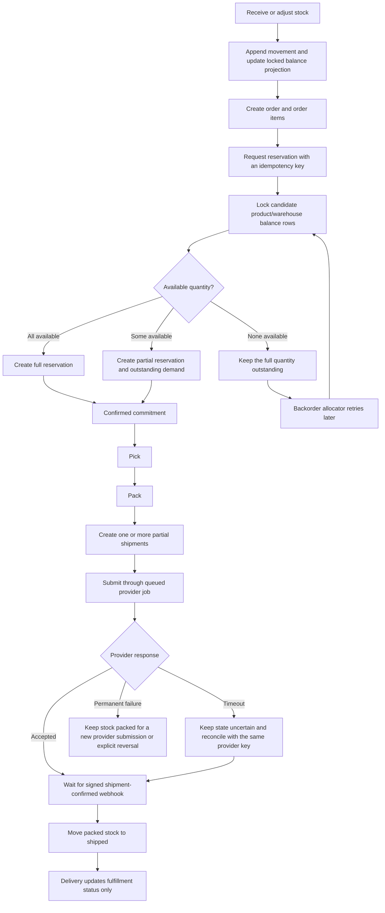

# Business Rules Handbook

This handbook records the agreed behavior of the Warehouse Inventory Reservation Engine. It is the source for acceptance criteria, implementation decisions, tests, documentation, and the final walkthrough.

## Reading Order

1. [Decision Register](decision-register.md)
2. [Inventory and Ledger](inventory-and-ledger.md)
3. [Orders and Reservations](orders-and-reservations.md)
4. [Fulfillment and Shipping](fulfillment-and-shipping.md)
5. [Mock Shipping Provider](mock-shipping-provider.md)
6. [Reliability and Security](reliability-and-security.md)
7. [Interfaces and Scope](interfaces-and-scope.md)
8. [Acceptance Scenarios](acceptance-scenarios.md)

## Design Objective

Inventory correctness has priority over throughput and feature count. The design must guarantee:

1. No projected inventory bucket becomes negative.
2. The same physical quantity is not committed twice.
3. Repeating the same business operation does not repeat its effect.
4. Related balance, movement, reservation, and history writes are atomic.
5. Every persisted balance can be reconstructed from immutable movements.
6. External timeouts and duplicate callbacks never silently corrupt inventory.
7. Partially allocated and partially fulfilled quantities remain explicit until fulfilled or cancelled.

## Core Business Flow

## Vocabulary

| Term | Meaning |
| --- | --- |
| Available | Stock physically present and not committed to an order |
| Reserved | Stock committed to an order but not picked |
| Picked | Stock removed from its storage location for an order |
| Packed | Picked stock prepared for carrier handoff |
| Shipped | Stock that has left the warehouse after confirmed handoff |
| Delivered | Shipped stock confirmed as delivered to the customer |
| On hand | `available + reserved + picked + packed` at one warehouse |
| Outstanding allocation | Ordered quantity not cancelled, shipped, reserved, picked, or packed |
| Movement ledger | Immutable canonical record of stock moving between buckets and locations |
| Balance projection | Synchronously maintained current bucket totals used for locking and fast queries |
| Operation | One idempotent business intent such as reserve, release, transfer, or confirm shipment |
| Backorder | Outstanding order-item quantity waiting for allocation |
| Temporary reservation | Expiring hold that must be confirmed before warehouse fulfillment |
| Confirmed reservation | Non-expiring commitment eligible for pick and pack operations |

## Rule Hierarchy

When rules appear to conflict, apply them in this order:

1. Database and inventory invariants.
2. Idempotency and transaction guarantees.
3. Physical warehouse lifecycle rules.
4. Order and allocation rules.
5. Interface behavior.

The Blade controllers, commands, jobs, and provider webhook must call shared application services. An optional future API must use those same services. No entry point may implement a second version of a business rule.

## Change Control

- Accepted rules require an explicit decision before they change.
- Deferred rules must not block the core design or require a schema rewrite.
- Optional work may begin only after the core phase gates pass.
- Provisional presentation choices may change after the system is complete.
- Any change must update the [Decision Register](decision-register.md), affected rules, plan tasks, and tests together.
