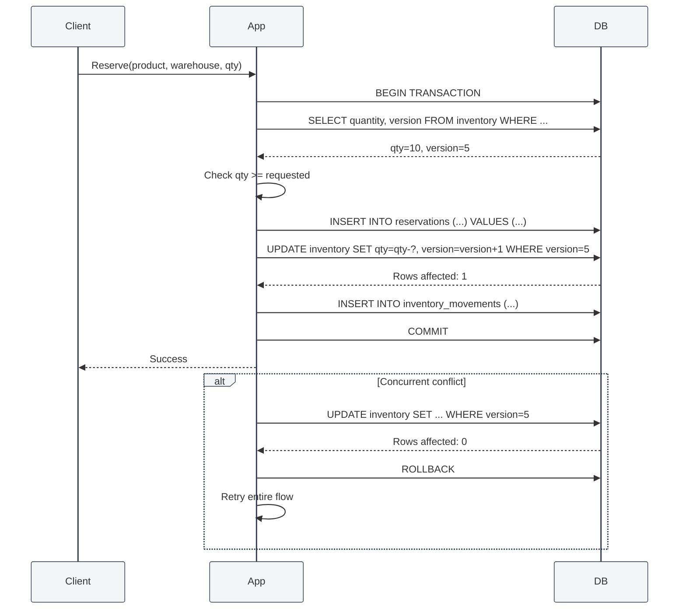

# Approach 1 — Optimistic Locking

## Core Idea

Every inventory-affecting record carries a **`version`** column (integer, monotonic). Before updating a row, the application compares the version it read with the current version in a `WHERE version = ?` clause. If the version has changed, the update affects zero rows — the application detects this, rolls back, and retries the entire operation.

No row-level locks are held during reads, so the system stays responsive under load. However, under high contention, retry rates increase.

---

## Database Schema

> 🎨 **Visual ERD diagram available in:** [`01-optimistic-locking.excalidraw`](./01-optimistic-locking.excalidraw)
> Open this file in VS Code with the **Excalidraw** extension to see the full interactive ERD with all tables, fields, and relationships.

---

## Key Tables

### `inventory`

The central stock record. **Every critical write includes**:

```sql
UPDATE inventory
   SET quantity = quantity - ?,
       version  = version + 1
 WHERE product_id = ?
   AND warehouse_id = ?
   AND version = ?
   AND quantity >= ?  -- oversell guard
```

If `ROW_COUNT()` returns 0, either the version was stale or stock was insufficient — the application retries from the beginning.

### `reservations`

Tracks which portion of inventory is spoken for. The `status` column cycles through `active → partial → released | shipped`. Each transition increments the version.

### `inventory_movements`

Immutable audit trail. The `before_quantity` and `after_quantity` columns provide point-in-time snapshots, making it possible to reconstruct state at any moment without replaying the entire ledger.

### `reservation_history`

Tracks every state transition of a reservation. Useful for debugging concurrent conflicts.

---

## Reservation Flow



---

## Handling Concurrency & Edge Cases

| Scenario                              | How It's Handled                                                                                                                      |
| ------------------------------------- | ------------------------------------------------------------------------------------------------------------------------------------- |
| **Two users reserve last item**       | First `UPDATE` succeeds (version matched). Second sees 0 rows affected, retries, finds `quantity=0`, fails with "insufficient stock". |
| **Duplicate reservation command**     | Use `order_id + product_id + warehouse_id` unique constraint on `reservations` (or idempotency key). Second insert fails — safe.      |
| **Background job retry**              | Same idempotency key mechanism. Second run is a no-op.                                                                                |
| **Duplicate shipment webhook**        | `tracking_number` unique constraint on `shipments`. Second insert fails.                                                              |
| **Worker crash mid-flow**             | Transaction auto-rolls back. No partial state persists.                                                                               |
| **Partial cancellation**              | Release the remaining reservation quantity, increase inventory, log movement.                                                         |
| **Warehouse transfer while reserved** | Fails at the application level — reservations must be released before transfer.                                                       |

---

## Assumptions & Trade-offs

### Assumptions

1. **Conflicts are rare.** Optimistic locking works best when two users rarely contend for the same product/warehouse combo.
2. **Retries are acceptable.** The application layer handles retry logic (with exponential backoff).
3. **Inventory is homogenous.** We track quantity only — no serial numbers or lot tracking.
4. **Idempotency keys are used.** Every external trigger (command, job, webhook) carries a unique idempotency key.

### Trade-offs

| Pro                             | Con                                                             |
| ------------------------------- | --------------------------------------------------------------- |
| No DB locks held during reads   | Under high contention, retry rate rises                         |
| Simple, well-understood pattern | Application must implement retry logic with backoff             |
| All databases support it        | Stale reads are possible (but harmless — writes still validate) |
| Easy to reason about            | Not suitable for hotly contested single-SKU items               |

### When to Choose This Approach

- You expect < 5% conflict rate on inventory writes.
- You want minimal database overhead.
- You have good observability to detect and alert on high retry rates.
- You can tolerate occasional retry-driven latency spikes.
