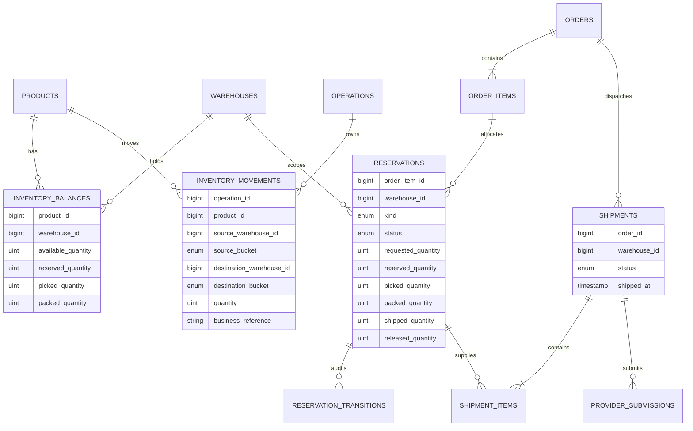
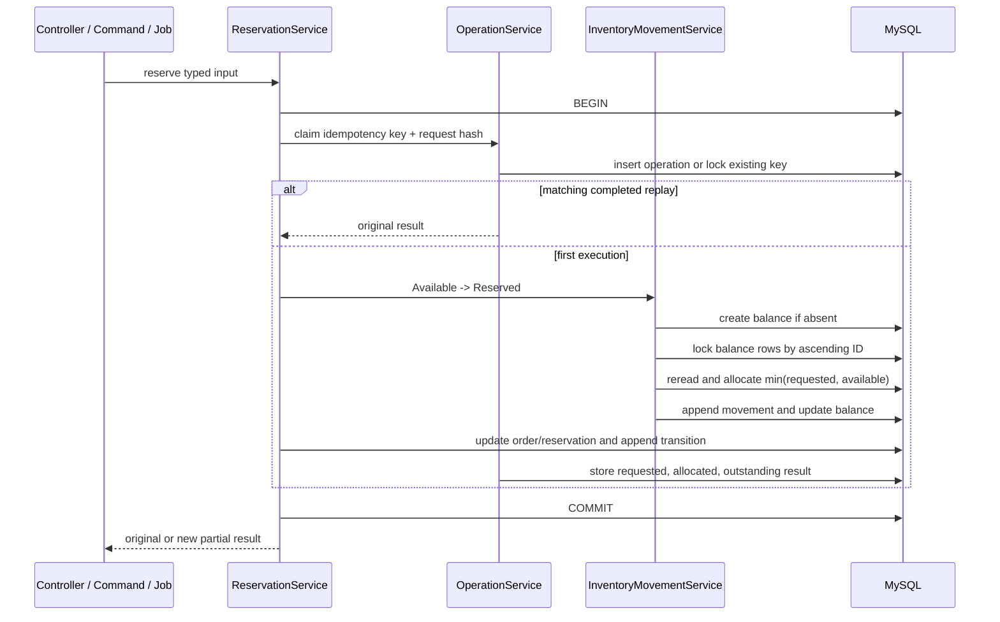

# Selected Approach — Pessimistic Locking with a Movement Ledger

## Document Status

This is the implemented summary of the selected approach. The [interactive presentation](02-pessimistic-locking-presentation.html) and [Excalidraw file](02-pessimistic-locking.excalidraw) were created during design exploration; they explain the approach but are not the final schema contract.

For the complete implemented schema, services, provider flow, trade-offs, and test evidence, read [System Architecture](../ARCHITECTURE.md).

## Core Idea

Inventory decisions run in short MySQL transactions. Each transaction locks the affected `inventory_balances` rows with `SELECT ... FOR UPDATE`, rereads their current quantities, validates the source bucket, appends an `inventory_movement`, and applies the same movement to the balance projection before commit.

Ordinary non-locking reads can continue through MySQL's MVCC behavior. Competing writers for the same product/warehouse balance wait and then make their decisions from the committed result rather than from the same stale quantity.

This favors a clear correctness proof over maximum write throughput for one hot stock key.

## Implemented Data Shape



One balance exists per `(product_id, warehouse_id)`. Its mutually exclusive physical buckets are:

```text
available + reserved + picked + packed = on hand
```

Shipped goods have left the warehouse. `shipped` is therefore an external movement destination, not a mutable balance bucket. Delivered quantity is cumulative progress inside shipped quantity and is not an inventory movement.

## Actual Reservation and Fulfillment States

Reservations have:

- Kind: `temporary` or `confirmed`.
- Status: `open`, `released`, `expired`, or `closed`.
- Current physical quantities: reserved, picked, packed, shipped, and released.

The physical flow is:

```text
External -> Available -> Reserved -> Picked -> Packed -> External/Shipped
```

Temporary reservations may be confirmed or expire. Confirmed reservations do not expire automatically. Picked and packed inventory must use explicit physical reversal operations before it becomes available again.

The system does not persist `active`, `partially_picked`, or separate delivery/shipment-progress statuses. Progress is derived from explicit quantities.

## Atomic Reservation Flow



Partial allocation is valid. If 10 units are requested and only 6 are available, the result says:

```text
requested = 10
allocated = 6
outstanding = 4
```

The remaining four stay discoverable for allocation after a stock receipt or by the scheduled backorder command.

## Lock Ordering and Transaction Boundary

- Every affected balance is resolved before the lock query.
- Balance rows are locked in ascending primary-key order.
- Reservations, order items, shipments, and shipment items are also queried in deterministic order where a workflow touches several rows.
- Laravel retries selected database transactions up to three times for transient deadlocks.
- External provider HTTP calls never run while inventory locks are held.
- An exception rolls back operation state, movement history, projection updates, and lifecycle history together.

There is no separate `InventoryLockService`. Lock ownership remains in the application service that owns the transaction and in the focused `InventoryMovementService`.

## Idempotency and Duplicate Processing

The central `operations` table has a globally unique operation key, operation type, canonical SHA-256 request hash, status, and original result.

- Same key, type, and payload returns the stored result.
- Same key with changed input is a conflict.
- Concurrent use of one key is resolved by the database unique constraint.
- A rolled-back transaction leaves no completed operation.

Provider calls use a different stable `provider_request_key`. Provider callbacks use unique `(provider, external_event_id)` receipt identity plus exact raw-body comparison. These keys solve different retry boundaries and are intentionally not conflated.

## Shipping Boundary

Shipment creation and provider acceptance do not deduct inventory. A shipment remains `pending_handoff` until a valid signed `shipment.confirmed` callback is persisted and processed.

That confirmation atomically moves:

```text
Warehouse / Packed -> External / Shipped
```

A duplicate confirmation cannot repeat the movement. An out-of-order delivery receipt remains pending until handoff exists. Provider status reconciliation can request callback redelivery but cannot mark inventory shipped directly.

## Concurrency and Failure Scenarios

| Scenario | Implemented protection |
| --- | --- |
| Two requests reserve the final unit | The second writer waits for the locked balance, rereads zero available, and receives a zero-allocation result. |
| Opposite-direction transfers | Both transactions lock balance IDs in the same order. |
| Duplicate browser or command request | The operation key returns the original stored result. |
| Same key with changed payload | Canonical request-hash comparison rejects the conflict. |
| Failure after movement append | The caller transaction rolls back movement, projection, transition, and operation together. |
| Provider acceptance or timeout | Packed stock remains unchanged. |
| Duplicate callback | Unique receipt identity and idempotent processing prevent another movement. |
| Out-of-order delivery | The durable receipt waits for shipment confirmation. |
| Worker stops after persisted state | Scheduled sweepers rediscover pending work. |

The focused proof is mapped in [Testing Evidence](../testing-evidence.md).

## Trade-offs

| Benefit | Cost |
| --- | --- |
| Simple final-unit correctness argument | Writers for one hot balance serialize. |
| Atomic ledger, projections, history, and idempotency | Transactions must remain short and consistently ordered. |
| Partial allocation is deterministic after the lock | Lock waits and deadlocks must be observable and retried carefully. |
| MySQL constraints protect core stored invariants | The design assumes one primary write authority. |
| Easy operational reads from balance projections | The append-only ledger needs archival or partitioning at very high volume. |

Before changing the consistency model, production scaling should measure hot keys, lock waits, deadlocks, query latency, and queue lag. Likely first steps are shorter transactions, batched recovery claims, movement-history partitioning, reporting replicas/projections, and selective per-SKU serialization—not automatic event sourcing.
