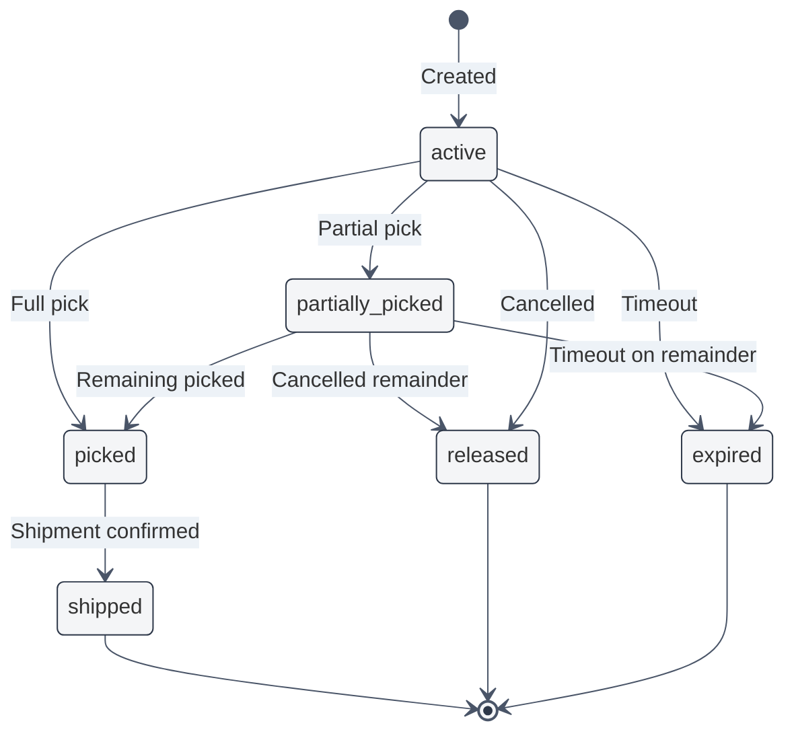
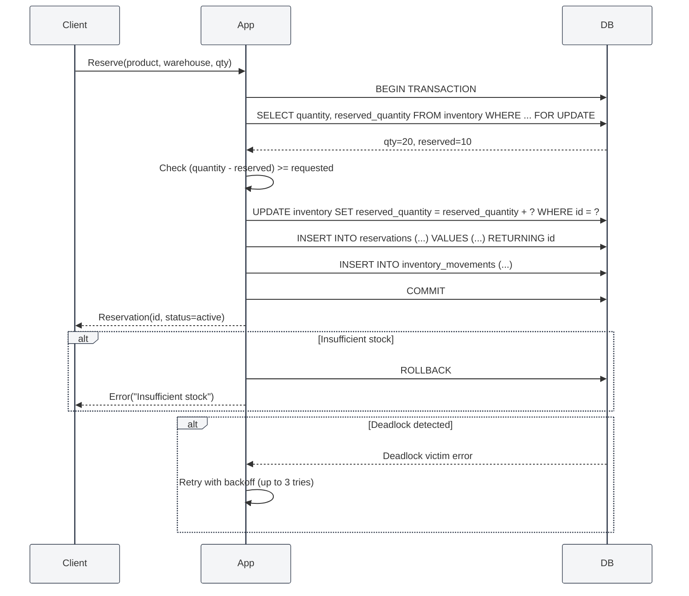

# Approach 2 — Pessimistic Locking & State Machine

## Core Idea

Inventory records are locked at the database level using `SELECT ... FOR UPDATE` within short-lived transactions. While a transaction holds the lock, no other transaction can read or write those rows. A **strict state machine** governs valid transitions for inventory and reservations, making invalid states impossible by design.

This is the most conservative approach — it prioritises correctness over throughput.

---

## Database Schema

> 🎨 **Visual ERD diagram available in:** [`02-pessimistic-locking.excalidraw`](./02-pessimistic-locking.excalidraw)
> Open this file in VS Code with the **Excalidraw** extension to see the full interactive ERD with all tables, fields, and relationships.

---

## State Machine

### Reservation Status Flow



### Explicitly disallowed transitions (enforced by CHECK / application logic):

- `active → shipped` (must go through `picked` first)
- `released → active` (released is terminal)
- `shipped → picked` (no reversal after shipment)

---

## Reservation Flow (Atomic)



---

## Key Design Decisions

### `inventory` — Multi-Column Running Totals

Instead of a single `quantity` column, we track each stage separately:

```sql
CHECK (quantity >= 0),
CHECK (reserved_quantity >= 0),
CHECK (picked_quantity >= 0),
CHECK (shipped_quantity >= 0),
CHECK (reserved_quantity <= quantity),
CHECK (picked_quantity <= reserved_quantity),
CHECK (shipped_quantity <= picked_quantity)
```

These `CHECK` constraints make it **impossible** for inventory to become inconsistent at the SQL level.

### `SELECT ... FOR UPDATE` — Lock Ordering

All transactions that touch inventory must lock rows in **product_id, warehouse_id** order to prevent deadlocks. A centralised `InventoryLockService` enforces this ordering.

### Short-Lived Transactions

Transactions are kept under 200ms. Any operation expected to take longer (e.g., external API calls) is **moved outside the transaction** — the transaction only covers the database state change.

### Deadlock Handling

The application catches deadlock errors (MySQL `1213`, PostgreSQL `40P01`) and retries up to 3 times with exponential backoff.

---

## Handling Concurrency & Edge Cases

| Scenario                               | How It's Handled                                                                                                            |
| -------------------------------------- | --------------------------------------------------------------------------------------------------------------------------- |
| **Two users reserve last item**        | Second `SELECT FOR UPDATE` blocks until first transaction commits. After commit, second re-reads and finds `available = 0`. |
| **Duplicate reservation command**      | Unique constraint on `(order_id, product_id, warehouse_id)` in `reservations`. Second insert fails.                         |
| **Deadlock between concurrent orders** | Caught at DB driver level. Retried with exponential backoff. Lock ordering minimises occurrence.                            |
| **Worker crash mid-transaction**       | DB auto-rollback. No partial state.                                                                                         |
| **Duplicate shipment webhook**         | `tracking_number` unique constraint. Idempotency check before processing.                                                   |
| **Overselling prevention**             | `CHECK (reserved_quantity <= quantity)` constraint — a physical guarantee.                                                  |
| **Warehouse transfer while reserved**  | Application blocks transfer if `reserved_quantity > 0`. Admin override requires releasing first.                            |

---

## Assumptions & Trade-offs

### Assumptions

1. **Short transactions are possible.** All business logic for a reservation completes in < 200ms.
2. **Lock contention is manageable.** Peak concurrency per product/warehouse is < 50 simultaneous writers.
3. **Database is a single primary.** Pessimistic locking requires a single write master — read replicas cannot participate.
4. **Pick/pack/ship follows the state machine.** Operators progress through the defined stages in order.

### Trade-offs

| Pro                                              | Con                                                  |
| ------------------------------------------------ | ---------------------------------------------------- |
| Strongest consistency — impossible to oversell   | Row locks reduce throughput under high concurrency   |
| No application retry logic for version conflicts | Deadlocks possible (though manageable)               |
| State machine makes invalid states impossible    | Requires a single write database (no multi-master)   |
| Intuitive to reason about                        | Read scalability limited (FOR UPDATE blocks readers) |

### When to Choose This Approach

- Inventory value is high and overselling is catastrophic.
- You have moderate write concurrency and short transactions.
- Your database is a single primary (or you use a distributed lock manager).
- You need CHECK-level guarantees, not just application-level checks.
- Compliance requirements demand provable consistency.
