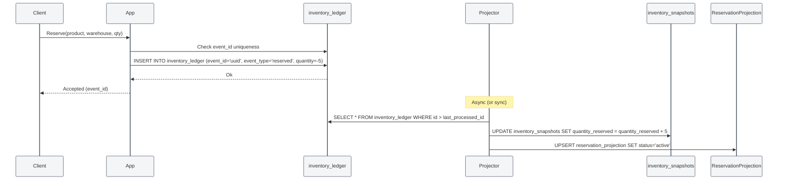
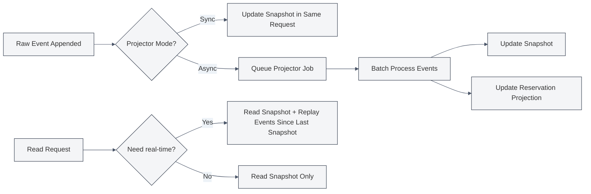

# Approach 3 — Event Sourcing / Ledger

## Core Idea

Inventory state is never updated in place. Instead, every action that affects inventory is **appended as an immutable event** to an `inventory_ledger` table. Current stock, reservations, and shipment states are **projected** from the ledger by summing relevant events.

Because the ledger is append-only, there are no locks, no version conflicts, and no way to lose history. Every retry or duplicate event is handled via idempotency keys — if the event already exists, it is silently ignored.

---

## Database Schema

> 🎨 **Visual ERD diagram available in:** [`03-event-sourcing.excalidraw`](./03-event-sourcing.excalidraw)
> Open this file in VS Code with the **Excalidraw** extension to see the full interactive ERD with all tables, fields, and relationships.

---

## Core Concept — The Ledger

Every state change is an **event** in `inventory_ledger`. The stock position for any product/warehouse at any point in time is:

```sql
-- Current available stock
SELECT SUM(quantity) FROM inventory_ledger
WHERE product_id = ?
  AND warehouse_id = ?
  AND event_type IN ('received', 'reserved', 'released', 'shipped', 'adjusted')
GROUP BY product_id, warehouse_id;
```

But **aggregating the full ledger on every request is slow**. So we use two strategies:

### 1. Materialised Snapshots (`inventory_snapshots`)

A scheduled job (or inline trigger after N events) computes a current-state snapshot. Read queries use the latest snapshot and then apply only the delta since `last_ledger_id`.

### 2. Projection Tables (`reservation_projection`)

`reservation_projection` is kept up-to-date by a **projector** — a process that reads new ledger events and updates the projection. This is not updated in the same transaction as the ledger, so it is **eventually consistent**. If absolute read consistency is needed, the projector can run synchronously.

---

## Reservation Flow



### Idempotency in action

If the same request arrives twice (retry, duplicate webhook, etc.):

```sql
INSERT INTO inventory_ledger (event_id, event_type, quantity, ...)
VALUES ('fixed-uuid', 'reserved', -5, ...);

-- If event_id already exists:
-- PostgreSQL: ON CONFLICT (event_id) DO NOTHING
-- MySQL: INSERT IGNORE
```

The second insert is a no-op. The caller receives the same `event_id` back — the operation is idempotent.

---

## Handling Concurrency & Edge Cases

| Scenario                              | How It's Handled                                                                                                                                                                                                                     |
| ------------------------------------- | ------------------------------------------------------------------------------------------------------------------------------------------------------------------------------------------------------------------------------------ |
| **Two users reserve last item**       | Both try to append a `reserved` event. The ledger checks the projected current stock. If insufficient, the second append is rejected at the application layer (after summing the snapshot). This is the eventual consistency window. |
| **Duplicate event (same event_id)**   | `INSERT ON CONFLICT DO NOTHING`. Silent no-op.                                                                                                                                                                                       |
| **Background job retry**              | Same `event_id` → no-op. Jobs carry a deterministic event ID derived from input params.                                                                                                                                              |
| **Duplicate shipment webhook**        | Webhook carries carrier's `external_id`. `SHIPMENTS.external_id` is unique. Second insert fails → idempotent.                                                                                                                        |
| **Worker crash mid-processing**       | If the event was appended before the crash, the projector picks it up on restart. If not, the caller retries with the same event_id. At-most-once append, exactly-once projection.                                                   |
| **Partial cancellation**              | Append a `released` event for the cancelled quantity. The projector updates both the snapshot and the reservation projection.                                                                                                        |
| **Warehouse transfer while reserved** | Append a `released` event at source + `received` event at destination. If a reservation exists, release it first (application rule).                                                                                                 |
| **Stock never negative**              | The projector/snapshot computation enforces `sum(quantity) >= 0` for available stock. A `reserved` event that would push stock negative is rejected before append — or accepted and flagged for reconciliation.                      |

---

## Snapshot & Projection Strategy



### Snapshot Refresh Policy

| Strategy                                     | Latency        | Read Consistency | Complexity |
| -------------------------------------------- | -------------- | ---------------- | ---------- |
| Sync (same transaction)                      | +5ms per write | Strong           | Low        |
| Async (queued projector)                     | 50–500ms       | Eventual         | Moderate   |
| Hybrid (sync for high-value, async for bulk) | Configurable   | Mixed            | Higher     |

---

## Assumptions & Trade-offs

### Assumptions

1. **Append performance matters most.** Writes are fast (sequential append) but reads require aggregation.
2. **Idempotency is mandatory.** Every event has a unique, deterministic `event_id`.
3. **Eventual consistency is acceptable** for read paths (stock levels may lag by milliseconds to seconds).
4. **Storage is cheap.** Ledger tables grow indefinitely — you need a retention/archival strategy.

### Trade-offs

| Pro                                                                 | Con                                                                     |
| ------------------------------------------------------------------- | ----------------------------------------------------------------------- |
| **Complete audit trail** — every event is immutable and timestamped | **Reads are expensive** — need snapshots or projections for performance |
| **No locking** — append-only means no write contention              | **Storage grows** — needs compaction or archival                        |
| **Natural idempotency** — event_id makes duplicates harmless        | **Eventual consistency** — projections lag behind the ledger            |
| **Temporal queries** — "what was stock on Jan 1?" is trivial        | **Schema complexity** — ledgers + projectors + snapshots                |
| **Perfect for debugging** — replay events to reproduce any state    | **Projector failures** — if the projector falls behind, reads are stale |

### When to Choose This Approach

- You need a **regulatory-grade audit trail** (FDA, SOX, IFRS compliance).
- Your write volume is high and you want to avoid locking entirely.
- You have the infrastructure to run reliable event projectors.
- You need point-in-time stock reconstruction ("what was our position at midnight?").
- Your team is comfortable with CQRS/event-sourcing patterns.

### When NOT to Choose This Approach

- You need strong read consistency with no lag.
- Your team is unfamiliar with event projection patterns.
- Storage costs are a concern.
- Your reads heavily outnumber writes (the overhead of aggregation hurts).
