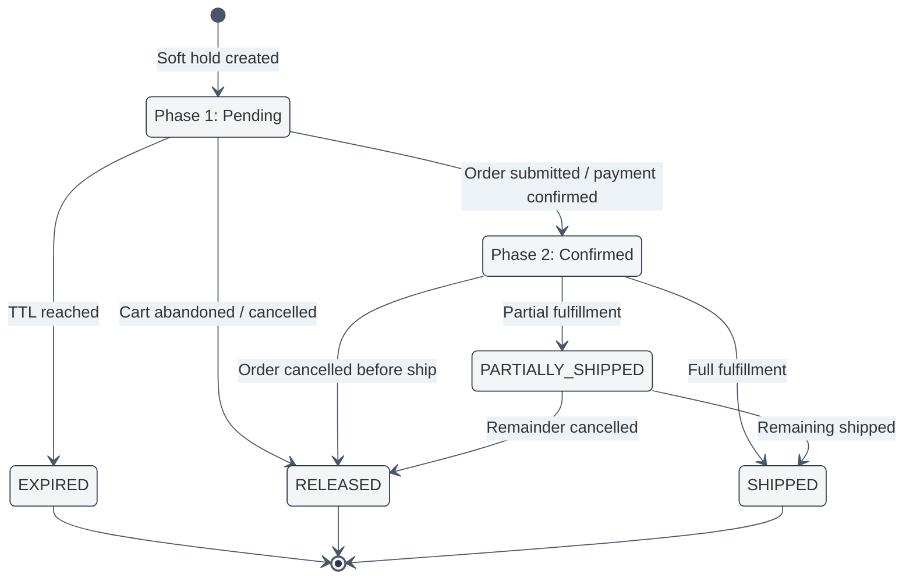
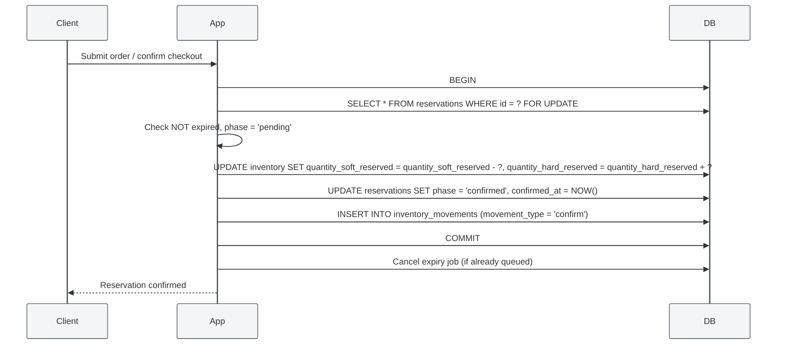

# Approach 4 — Two-Phase Reservation with Timeout

## Core Idea

Reservations follow a **two-phase lifecycle**: `pending` → `confirmed` (or `expired`).

- **Phase 1 (Pending):** A "soft hold" is placed on inventory. The stock is not yet deducted from available inventory, but it is tracked so other users can see it is claimed. Pending reservations have a configurable TTL.
- **Phase 2 (Confirmed):** The hold is hardened — inventory is actually deducted. This happens when the order is submitted/payment confirmed.

If a pending reservation expires, the soft hold is released and the inventory becomes available again.

This is the model used by e-commerce platforms, ticketing systems, and airline booking engines.

---

## Database Schema

> 🎨 **Visual ERD diagram available in:** [`04-two-phase-reservation.excalidraw`](./04-two-phase-reservation.excalidraw)
> Open this file in VS Code with the **Excalidraw** extension to see the full interactive ERD with all tables, fields, and relationships.

---

## Lifecycle



---

## Reservation Flows

### 1. Soft Reserve (Phase 1)

```mermaid
%%{init: {'theme':'base', 'themeVariables': {'primaryColor':'#f4f5f7', 'primaryBorderColor':'#2d3748', 'lineColor':'#4a5568', 'secondaryColor':'#edf2f7', 'tertiaryColor':'#ffffff', 'background':'#ffffff'}}}%%
sequenceDiagram
    participant Client
    participant App
    participant DB

    Client->>App: Add to cart (product, qty)
    App->>DB: SELECT quantity_on_hand, quantity_soft_reserved, quantity_hard_reserved
    App->>App: available = on_hand - soft - hard; Check >= qty
    App->>DB: UPDATE inventory SET quantity_soft_reserved = quantity_soft_reserved + ?
    App->>DB: INSERT INTO reservations (phase='pending', status='active', expires_at=NOW() + INTERVAL '30 min')
    App->>DB: INSERT INTO reservation_timeline (event_type='created')
    App->>DB: Schedule expiry job (queue)
    App-->>Client: Pending reservation created (expires at +30 min)
```

### 2. Confirm Reservation (Phase 1 → Phase 2)



### 3. Expiry Handler (Scheduled Job)

```
php artisan reservations:process-expired
```

```sql
-- Runs every minute via the scheduler
UPDATE inventory i
   SET quantity_soft_reserved = quantity_soft_reserved - r.quantity
  FROM reservations r
 WHERE r.phase = 'pending'
   AND r.status = 'active'
   AND r.expires_at < NOW()
   AND i.product_id = r.product_id
   AND i.warehouse_id = r.warehouse_id;

UPDATE reservations
   SET status = 'expired'
 WHERE phase = 'pending'
   AND status = 'active'
   AND expires_at < NOW();
```

---

## Timeout Configuration

| Parameter                    | Default    | Description                                     |
| ---------------------------- | ---------- | ----------------------------------------------- |
| `RESERVATION_TTL`            | 30 minutes | How long a pending reservation lives            |
| `RESERVATION_MAX_EXTENSIONS` | 2          | Max times a user can extend                     |
| `EXPIRY_POLL_INTERVAL`       | 60 seconds | How often the expiry runner fires               |
| `HARD_RESERVATION_TIMEOUT`   | None       | Confirmed reservations never expire (by design) |

---

## Handling Concurrency & Edge Cases

| Scenario                                                     | How It's Handled                                                                                                                                                                                        |
| ------------------------------------------------------------ | ------------------------------------------------------------------------------------------------------------------------------------------------------------------------------------------------------- |
| **Two users add last item to cart**                          | Both get a soft reservation. Available stock hits zero. First to confirm gets it; second finds `phase = pending` but on confirm, inventory check fails → "sorry, sold out".                             |
| **Expired cart before confirm**                              | `expires_at` check in the confirm transaction. If expired → reject. User can re-add if stock still available.                                                                                           |
| **Duplicate confirm request**                                | Idempotency key on the confirm endpoint. Second call sees `phase = 'confirmed'` → returns success (idempotent).                                                                                         |
| **Worker crash during confirm**                              | Transaction rollback. Retry with same idempotency key.                                                                                                                                                  |
| **Duplicate webhook**                                        | `tracking_number` unique constraint + idempotency key on shipment events.                                                                                                                               |
| **Partial shipment**                                         | Confirm full reservation, then ship partial. Remaining hard reservation stays until shipped or released.                                                                                                |
| **Order cancellation after confirmation**                    | Hard release: decrement `quantity_hard_reserved`, increment `quantity_on_hand`. Log movement.                                                                                                           |
| **Soft reservation of last item, then another soft reserve** | Both succeed (soft reserves can exceed available stock). Only the confirm transaction enforces the hard limit. This is intentional — it matches e-commerce behaviour (carts don't fail until checkout). |

---

## Assumptions & Trade-offs

### Assumptions

1. **Soft reservations may oversell.** We allow `quantity_soft_reserved` to exceed available stock temporarily. Only confirmation enforces the hard boundary. This mirrors real-world e-commerce behaviour.
2. **Confirmed reservations are sacred.** Once confirmed, inventory is locked until shipped or explicitly released. No timeout on confirmed reservations.
3. **Expiry is eventual.** Due to the poll interval, expired reservations may linger for up to 60 seconds — acceptable for non-critical soft holds.
4. **Users can extend.** The TTL can be extended (e.g., "still shopping?" prompt) up to a maximum.

### Trade-offs

| Pro                                                                | Con                                                                   |
| ------------------------------------------------------------------ | --------------------------------------------------------------------- |
| **Graceful handling of abandoned carts** — inventory auto-releases | **Can briefly oversell** during the soft-reserve window               |
| **Better UX** — users can shop without immediate commitment        | **Background jobs needed** — expiry processor must be reliable        |
| **Configurable timeouts** — tune per product category if needed    | **Schema complexity** — two reservation phases increase query surface |
| **Matches real-world commerce flows**                              | **Reconciliation needed** — expired reservations must be audited      |
| **Prevents indefinite locks**                                      | Users may lose items if they take too long                            |

### When to Choose This Approach

- You are building an **e-commerce** or **sales-order** system.
- Shopping carts / quotation holds are a core business requirement.
- You want to prevent abandoned reservations from blocking inventory forever.
- Your domain has a natural two-phase process (e.g., "quote" → "order").
- You are willing to accept brief oversell windows for better user experience.

### When NOT to Choose This Approach

- Every reservation must be immediately binding (e.g., medical supplies).
- You cannot tolerate any overselling, even temporarily.
- You lack infrastructure for reliable background job scheduling.
