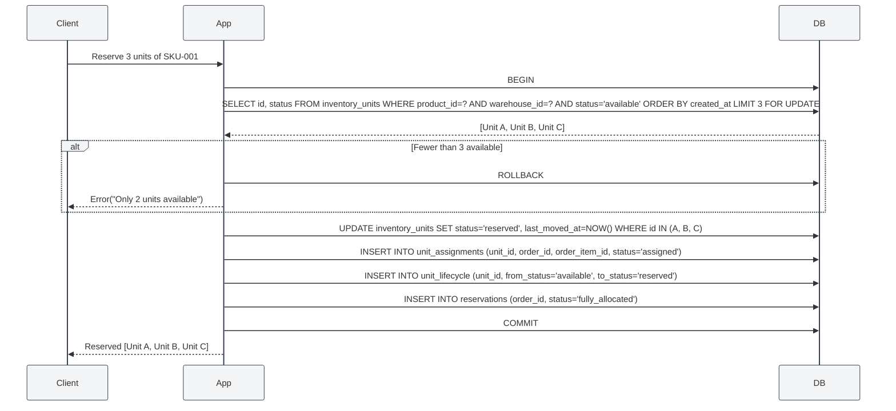
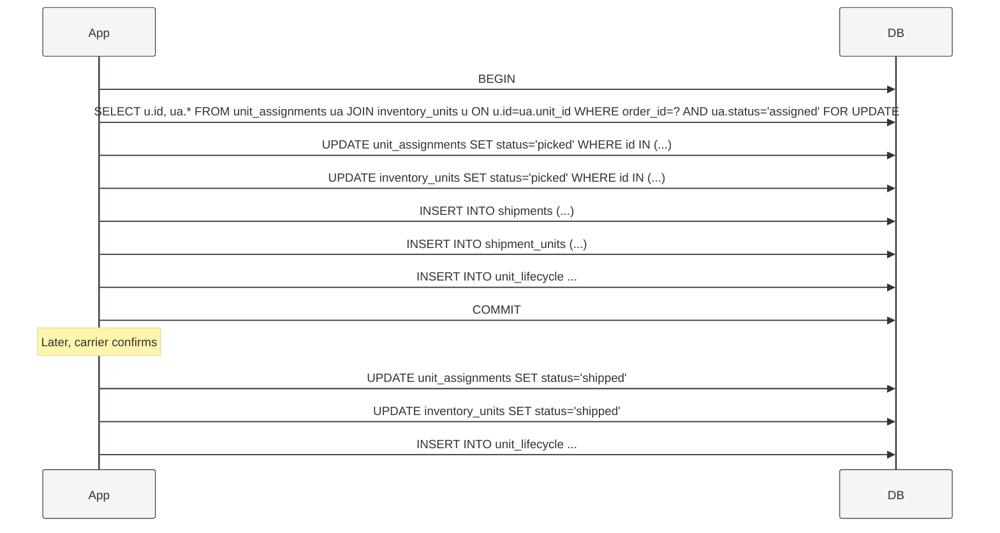

# Approach 5 — Discrete Unit / Serial Tracking

## Core Idea

Inventory is not tracked as an aggregated quantity. Instead, **every individual unit** (identified by serial number, lot/batch number, or a system-generated UID) is tracked independently through its lifecycle. A unit moves through states: `available → reserved → picked → packed → shipped → delivered`.

Because each unit is individually tracked, overselling is structurally impossible — you cannot reserve a unit that is already reserved. Reservation is simply assigning a unit to an order.

This is the approach used for high-value goods, regulated products, and any environment where lot/serial traceability is required.

---

## Database Schema

> 🎨 **Visual ERD diagram available in:** [`05-discrete-units.excalidraw`](./05-discrete-units.excalidraw)
> Open this file in VS Code with the **Excalidraw** extension to see the full interactive ERD with all tables, fields, and relationships.

---

## Allocation Strategies

Different products may use different strategies for **which unit to assign**:

| Strategy                          | Description                                    | Best For                            |
| --------------------------------- | ---------------------------------------------- | ----------------------------------- |
| **FIFO** (First-In-First-Out)     | Assign the oldest received unit first          | General goods, perishables          |
| **FEFO** (First-Expiry-First-Out) | Assign the unit closest to expiry first        | Pharmaceuticals, food               |
| **FEFO + Lot**                    | Within-lot FEFO, pick lot with earliest expiry | Regulated industries                |
| **MANUAL**                        | Operator explicitly selects which unit to pick | High-value, custom-configured items |

Example FIFO query:

```sql
SELECT u.id
FROM inventory_units u
WHERE u.product_id = ?
  AND u.current_warehouse_id = ?
  AND u.status = 'available'
ORDER BY u.created_at ASC   -- FIFO
LIMIT ?;
```

---

## Reservation Flow



### Key constraint — uniqueness

```sql
-- A unit can only be assigned to one order
CREATE UNIQUE INDEX idx_single_assignment
ON unit_assignments (unit_id)
WHERE status IN ('assigned', 'picked', 'packed');  -- Partial index — only active assignments
```

This is a **database-enforced guarantee** that no unit is double-allocated.

---

## Shipment Flow



---

## Handling Concurrency & Edge Cases

| Scenario                          | How It's Handled                                                                                                                                                                |
| --------------------------------- | ------------------------------------------------------------------------------------------------------------------------------------------------------------------------------- |
| **Two users reserve same units**  | Impossible — `FOR UPDATE` locks the available units. Second transaction blocks, then sees those units no longer `available`.                                                    |
| **Duplicate reservation command** | Idempotency key on the outer request. Unique constraint on `(unit_id, order_id)` in `unit_assignments`.                                                                         |
| **Background job retry**          | Same idempotency key. `unit_assignments` already exists → no-op.                                                                                                                |
| **Duplicate shipment webhook**    | `tracking_number` unique. `shipment_units.unit_id` unique — already exists → no-op.                                                                                             |
| **Partial shipment**              | Ship subset of assigned units. Remaining stay `assigned`. `ORDER.status` → `partial`.                                                                                           |
| **Return / reverse**              | Unit comes back: create a new `unit_lifecycle` entry. Unit status → `available` (or `quarantined` for inspection). A new `unit_identifier` may be assigned depending on policy. |
| **Overselling**                   | Structurally impossible. If there are 2 available units, you can reserve at most 2. The `FOR UPDATE` + row count check makes this watertight.                                   |
| **Warehouse transfer**            | Change `current_location_id` and `current_warehouse_id`. Only allowed if `status = 'available'` or the reservation is released first.                                           |
| **Quarantine a unit**             | Set `status = 'quarantined'`. It is excluded from all allocation queries. `unit_lifecycle` records the reason.                                                                  |

---

## Inventory Queries

### Available stock count

```sql
SELECT COUNT(*) FROM inventory_units
WHERE product_id = ?
  AND current_warehouse_id = ?
  AND status = 'available';
```

### Reserved but not yet picked

```sql
SELECT u.* FROM inventory_units u
JOIN unit_assignments ua ON ua.unit_id = u.id
WHERE u.product_id = ?
  AND ua.status = 'assigned';
```

### Full trace for a single serial number

```sql
SELECT * FROM unit_lifecycle
WHERE unit_id = (SELECT id FROM inventory_units WHERE unit_identifier = 'SN-12345')
ORDER BY created_at;
```

---

## Assumptions & Trade-offs

### Assumptions

1. **Unit count is manageable.** This approach works best for < 10M units per warehouse. Beyond that, the row count and query performance require careful indexing.
2. **Products are identifiable.** Either serial numbers, lot numbers, or system-assigned UIDs exist per unit.
3. **FIFO/FEFO allocation is acceptable.** For bulk commodity goods (sand, gravel, oil), discrete units make no sense.
4. **Receiving creates units.** Every inbound shipment creates one or more `inventory_units` — there is no bulk add.

### Trade-offs

| Pro                                                    | Con                                                                    |
| ------------------------------------------------------ | ---------------------------------------------------------------------- |
| **Overselling is physically impossible**               | **Row count grows with unit count** — 10M units = 10M rows             |
| **End-to-end unit traceability**                       | **Complex allocation logic** — FIFO/FEFO queries need careful indexing |
| **No quantity sync issues** — each unit has one status | **More writes per operation** — each unit updated individually         |
| **Natural quarantine / return handling**               | **Overhead for bulk items** — not suitable for commodities             |
| **Unit-level cost tracking**                           | **More complex UI** — operators need to see individual units           |

### When to Choose This Approach

- You track **serial numbers** or **lot numbers** today.
- Products are **high-value** (electronics, medical devices, luxury goods).
- You need **regulatory traceability** (pharmaceutical pedigree, aircraft parts).
- You have a **warehouse management system** with bin locations and pick faces.
- "Where is this specific unit?" is a question you need to answer.

### When NOT to Choose This Approach

- You sell bulk commodities (sand, grain, liquid chemicals).
- You have millions of identical, interchangeable units.
- Your team is not ready for the operational complexity of unit-level tracking.
- Your inventory turns over at very high volume with low unit value.
